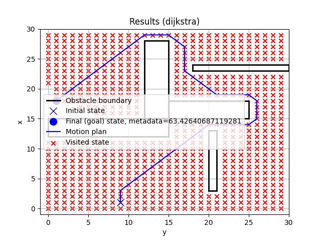
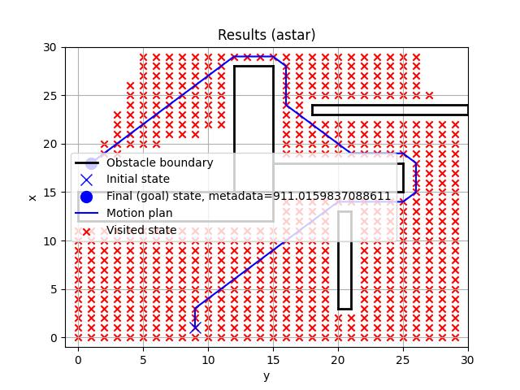

# About

This project is primarily pedagogical, although some might find it useful for prototyping or pet
projects. The project is in very early development.

# Vision

In a statement: Strongly typed motion planning library written in Python for Python.

Tentative roadmap:

- Implementations of discrete motion planning algorithms
    - [x] Breadth-first
    - [x] Depth-first
    - [x] Dijkstra's algorithm
    - [x] A\*
    - [ ] D\*
    - [ ] D\*-lite
- Implementations of continuous motion planning algorithms
    - [ ] Model-predictive control
    - [ ] Rapidly-Exploring Random Trees (RRT)
    - [ ] Potential fields
    - [ ] Probabilistic roadmap (PRM)
- Additional collision detection algorithm choices
- Better robot modeling support

# Demo

See below for some preliminary results for simple problems.

